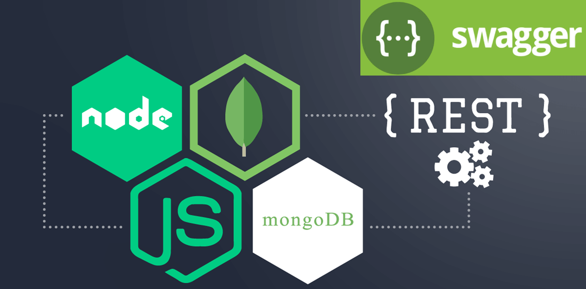

# magic-node.js

## Стек технологій

## Опис проекту

`Books:` Веб-додаток, який надає маршрути і функціональність для обробки запитів, пов'язаних з автентифікацією користувачів і роботою з книгами. Давайте розглянемо, які функції можна виконувати за допомогою цього додатку. API надає можливість користувачам реєструватися, входити в систему, отримувати та оновлювати дані про книги.

`Основні функції:`

Реєстрація нового користувача. Валідує дані реєстрації, реєструє користувача та надсилає лист для підтвердження електронної пошти.

Підтвердження електронної пошти користувача за кодом підтвердження.

Повторна відправка листа для підтвердження електронної пошти з новим кодом підтвердження.

Вхід користувача. Валідує дані для входу та надає токен доступу.

Отримання інформації про поточного користувача.

Вихід користувача.

Оновлення аватара користувача. Валідує та оброблює файл зображення користувача.

Отримання списку всіх книг.

Отримання інформації про певну книгу за ідентифікатором.

Додавання нової книги.

Оновлення інформації про певну книгу за ідентифікатором.

Оновлення статусу "улюблена" для певної книги за ідентифікатором.

Видалення певної книги за ідентифікатором.
